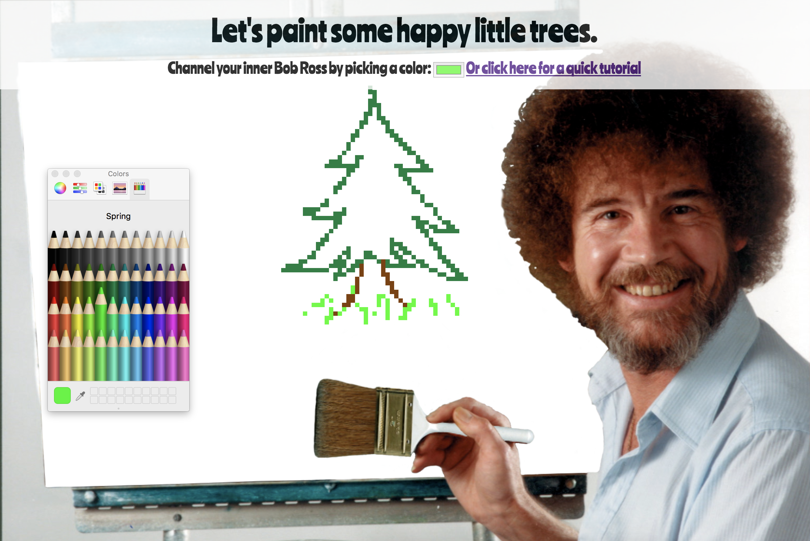

## Please watch the tutorial before proceeding: https://www.youtube.com/embed/VkF0IZ0Lgws

## Happy Trees Live Hosted URL: https://paint-some-happy-trees.firebaseapp.com/

# Pixel Art Maker
In this exercise, you'll create your own pixel art maker which will allow a user to choose colors from a palette and then paint pixel art. The interface is completely up to you, but it could look something like this.

This pixel art maker allows user to do the following:
1. Start with a blank canvas of pixels.
1. Select a brush color from a palette of colors.
1. Paint the pixels on the canvas using the brush color.
